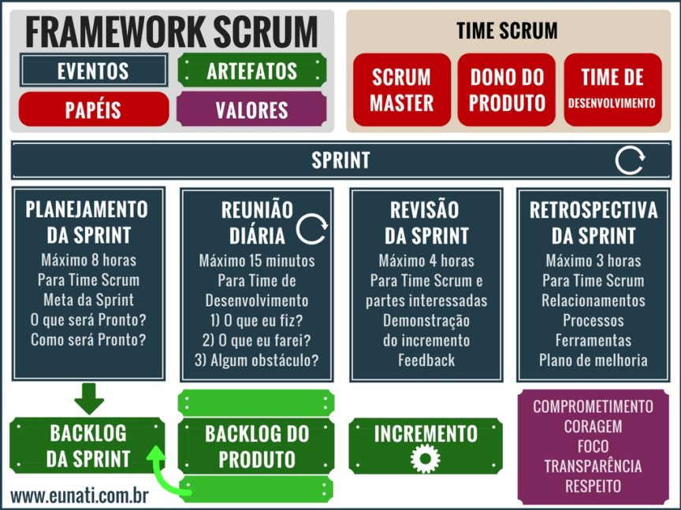

## Metodológias ágeis - scrum

### Manifesto Ágil

O documento que regeu o manifesto ágil possui 12 princípios.

 1. **Maior prioridade**
    A satisfação do cliente somados as entregas parciais e contínuas do software, de forma adianta e com valor agredado. Não há foco em documentações rígidas, e sim na iteração constante com o cliente.

2. **Mudanças são bem vindas.**
    O início do desenvolvimento de software é dificil identificar todos os requisitos. O software precisa amadurecer e o cliente muitas vezes não consegue prever todas as suas necessidades antes de ter uma versão funcional do software. O método ágil adota a filosofia de que mudanças feitas mais tarde no processo não são prejudiciais. Além dissotodas as mudanças que contribuem para a melhoria do software dentro das necessidades do cliente são bem-vindas.

3. **Entregas frequentes**
    As entregas devem ser frequentes, de funcionalidades que estejam usáveis no ideal do MVP (mínimo produto viável).Periodicidade de tempo de entregas rápidas dão um ritmo ao trabalho da equipe de desenvolvimento. Atrasos de entrega constantem denúnciam a falência dos prazos.

4. **Equipe única de negócios e desenvolvedores**
    Um dos princípios da abordagem ágil é ter uma equipe única de negócios e desenvolvedores, pois o trabalho conjunto das pessoas de negócio com os desenvolvedores é importante para manter a mesma comunicação durante todo o projeto. Portanto, PO e SM codam também.

5. **Motivação**
    Equipe motivada é sinal de qualidade no proeto. É necessário que haja uma confiança na equipe para o desenvolvimento do trabalho que precisa ser realizado. Na abordagem ágil as equipes ágeis são autogerenciadas, com uma comunicação direta e constante com feedbacks frequentes com o comprometimento de todos os envolvidos para a entrega.

6. **Conversa frente a frente.**
    Um dos princípios do manifesto ágil é a conversa frente a frente, face a face, presencial. É um método eficiente e eficaz para a transmissão de qualquer informação para a equipe e entre as equipes de desenvolvimento do software.. Os feedbacks devem ser diretos e na cara.

7. **Software Funcional**
    É preciso garantir enregas ao fim da sprint. Um dos princípios do manifesto ágil é a entrega de um software funcional em várias etapas até a entrega do projeto final do software que está sendo desenvolvido.

8. **Desenvolvimento sustentável**
    Para garantir um desenvolvimento sustentável no método ágil, é importante evitar a produtividade por horas de trabalho, o que cansa o desenvolvedor, porém, valorizando a produtividade pela capacidade criativa na execução.

9. **Agilidade**
    É importante direcionar a atenção às necessidades de mudança e evitar documentações extensas.

10. **Simplicidade**
    Criação e a entrega de um software de qualidade que resolve as necessidades do cliente. Isso é realmente essencial? É possível torná-lo simples? As respostas de perguntas como essas direcionam o desenvolvimento do software para a sua simplicidade.

11. **Times Auto Organizáveis**
    Buscar por um conjunto restrito e muito simples de regras que deve ser obedecido por todos os membros da equipe.
    
12. **Reflexões regulares**
    Compreender o processo em que está o desenvolvimento do software, assim como velocidade e dinamismo da equipe e cada um dos seus membros. Em conversas francas e dinâmicas de grupo.

## Pull Request e Code Review. Como fazer boas constribuições?

Passos para contribuir:

    while projeto == inacabado:
        1- Atualize a main
        2- Crie sua branch
        3- Realize commites atômicos
        4- Realize um push para criar um PR
        5- Peça codeReview
        6- Faça os reparos necessários no CodeReview
        7- Seja aprovado e mergeado

### O que é pull request?

**Pull Request** é a nossa forma de contribuição o projeto. Sugerimos a leitura dessa [documentação](https://www.digitalocean.com/community/tutorials/como-criar-um-pull-request-no-github-pt) especifica sobre como contribuir em um projeto GitHub.

Para algo de consulta rápida e explicações breve para o dia a dia, deixo esse [Medium](https://medium.com/@clarasantosmf/subindo-altera%C3%A7%C3%B5es-para-github-68a0b28f14d).

### O que é code review?
O **Code Review**  é um processo no fluxo de desenvolvimento de software. Alguém propõe alterações ou criação no código por meio de um *pull request* (PR) e é analisado por outras pessoas.
Isso ajuda identificar bugs e melhora a qualidade das implementações e compartilhar conhecimento.

A responsabilidade de manter o CR em dia é de todos. Todos podem fazer e opinar.

### Boas práticas

<aside>
💡 Antes de revisar o código, tenha como premissa que o autor do **PR** fez o seu melhor em prol de solucionar o problema.

</aside>

### **Revisor**

Leia a descrição do PR, deve estar descrito o problema que a implementação se propõe resolver. Não encontrou na descrição do PR? Peça para que o autor ajuste isso e dedique um tempo para entender o contexto e as motivações das mudanças.

Faça comentários através de observações, impactos, requisições e perguntas. Exemplos:

|  | ❌ ☹️ | ✅ 😀 | Por quê? |
| --- | --- | --- | --- |
| Observação | Você está fazendo uma implementação errada. | Essa implementação está repetida em outro contexto e poderia ser reutilizada. $LINK | A revisão é sobre o código, nunca sobre o autor. Fornecer links, quando possível, de certa forma é uma gentileza e ajuda o autor a entender seu ponto de vista. Sugerir rápidas edições pode ajudar também. |
| Impacto | Essa implementação não está clara. | Essa implementação não deixa claro o objetivo do método por X motivo. | Explicar o impacto permite que o autor entenda a motivação da sua observação e não desvaloriza o trabalho que já foi feito. |
| Requisição | - Use o padrão X. Faça Y. | Para esse cenário eu sugiro fazer/usar X, por N motivos | Um ponto de vista mais pessoal se aproxima da forma com que conversamos no dia a dia, afirmações no imperativo podem soar rudes. Explicar o motivo da requisição encoraja a colaboração. |
| Pergunta | Por que você não faz X? | O que você acha de fazer X? Pode ajudar em Y. | Por meio das respostas, podemos entender melhor a decisão para certo ponto do código. |

- Entenda que existem diferentes soluções para o mesmo problema:
    - Nem sempre a melhor solução é a que você esta propondo;
    - Com o time, chegue na melhor solução para o problema com o atual conhecimento deles;
- Tenha claro a distinção entre **boas práticas** e **gosto pessoal**;
- Deixe claro quais comentários são “bloqueantes” (não vai subir sem que aquilo seja ajustado) e você espera que haja uma alteração significativa.
- Se sua revisão possui apenas pequenos apontamentos que podem ser facilmente resolvidos, considere aprovar a solicitação e orientar o autor sobre isso nos comentários, de modo que ele não precise aguardar novamente.
- Se você acredita que PR está muito grande, explique o motivo e incentive o autor a dividi-lo em menores partes.
- Não foque em deixar o PR excelente (A+), mas em melhorá-lo a ponto de ficar MVP e planeje evoluções futuras.
- Antes de enviar o comentário de CR se pergunte:
    - A afirmação é verdadeira?
    - O comentário está agregando valor para o PR (principalmente se estamos contribuindo com o conhecimento do time e pessoa que abriu PR)?
    - Estou sendo gentil?

### **Autor**

Assuma como premissa que o revisor está querendo contribuir e tenha humildade para ouvir sobre o seu trabalho. **Você e o revisor são do mesmo time**.

### Você deve ✅

- Dar o máximo de contexto ao abrir um PR, lembre-se que o revisor não tem tanto contexto quanto você. Escreva uma boa descrição ou deixe um link nela.
- Encarar a revisão como aprendizado.
- Entender que somos sempre enviesados pelo nosso próprio código.
- Estar aberto a opiniões externas: seu código não é seu "bichinho de estimação".
- Entender que é normal ter bugs, implementações melhores ou esquecer de algum detalhe.

### Não deve ❌

- Encarar comentários como crítica pessoal;
- Levar críticas para o lado pessoal, **você não é o seu código**;

### **Código**

- Simples é melhor do que complexo: cuidado com **over-engineering** *(implemente o que você realmente precisa, não tente adivinhar o que você vai precisar no futuro);*
- Antes de aplicar um **design pattern**, tenha claro qual problema ele resolve e qual ele não resolve, para não cair em *~~anti-pattern~~* sem saber *([📖 livro](https://pragprog.com/titles/mnee2/release-it-second-edition/))*;

### Checklist

Ao revisar um código, é bom (para o autor e para o revisor) ter um checklist do que precisa ser avaliado. Conferir todos os aspectos do código de uma vez pode ser exaustivo e propenso a falhas, portanto é bom atentar-se a um tópico e validar todo conteúdo sob aquela ótica.

- [ ]  Entendi o problema?
- [ ]  Entendi o que o código está fazendo?
- [ ]  O código atende todos os requisitos de implementação?
- [ ]  A implementação resolve o problema apresentado ou está claro como mediremos isso?
- [ ]  A descrição da PR/commit está conforme a implementação feita?
- [ ]  Atenção a sintaxe, não tem nenhum *code smells/*indícios de um problema mais profundo?
- [ ]  As exceções necessárias foram tratadas?
- [ ]  Alguma documentação adicional precisa ser feita?

### **Referências**

- [Code Review Guidelines for Humans](https://phauer.com/2018/code-review-guidelines/)
- [How to Make Good Code Reviews Better - Stack Overflow Blog](https://stackoverflow.blog/2019/09/30/how-to-make-good-code-reviews-better/)
- [Boas práticas de reviews](https://google.github.io/eng-practices/review/)
